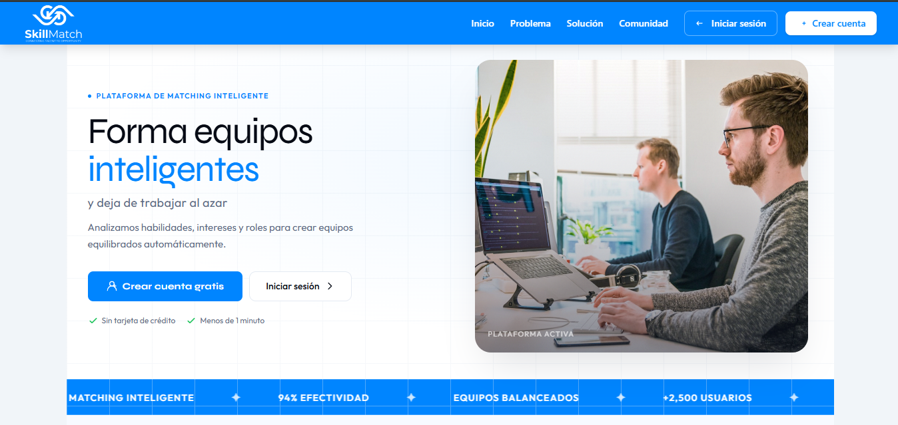

# SkillMatch

### Plataforma Inteligente para la Formación de Equipos

Sistema web diseñado para analizar habilidades, intereses y roles preferidos de estudiantes con el objetivo de generar equipos de trabajo equilibrados para proyectos académicos, hackatones y eventos de innovación.
 

 
---

## Acerca del proyecto.

SkillMatch surge como una solución al desafío de formar equipos de trabajo equilibrados en entornos académicos. Tradicionalmente, los equipos suelen conformarse de manera informal, lo que puede generar desequilibrios en habilidades, responsabilidades y participación.

La plataforma permite registrar perfiles de estudiantes, analizar sus habilidades e intereses y generar equipos equilibrados automáticamente para mejorar la colaboración y el desempeño de los proyectos.

---

## Problema

La formación de equipos en proyectos académicos suele realizarse basándose en amistades o decisiones rápidas, provocando:

* Distribución desigual de habilidades.
* Equipos poco equilibrados.
* Sobrecarga de responsabilidades en algunos integrantes.
* Menor eficiencia durante el desarrollo de proyectos.
* Dificultad para encontrar perfiles complementarios.

---

## Solución

SkillMatch recopila y analiza información de los participantes para generar equipos equilibrados considerando:

* Habilidades técnicas.
* Intereses.
* Roles preferidos.
* Capacidades de liderazgo.
* Competencias complementarias.

---

## Características principales

* Registro de estudiantes.
* Creación y gestión de perfiles.
* Captura de habilidades e intereses.
* Selección de roles preferidos.
* Gestión de eventos.
* Generación automática de equipos.
* Dashboard administrativo.
* Visualización de métricas y estadísticas.
* Diseño responsive para dispositivos móviles y escritorio.

---

## Flujo de funcionamiento

1. Registro de participantes.
2. Captura de habilidades e intereses.
3. Selección de roles preferidos.
4. Análisis de perfiles.
5. Generación automática de equipos equilibrados.
6. Visualización de resultados y métricas.

---

## Tecnologías utilizadas

| Tecnología   | Uso                           |
| ------------ | ----------------------------- |
| React        | Desarrollo de interfaz        |
| TypeScript   | Tipado estático               |
| Vite         | Entorno de desarrollo         |
| Tailwind CSS | Estilos y diseño              |
| Supabase     | Backend y base de datos       |
| PostgreSQL   | Almacenamiento de información |
| Git          | Control de versiones          |
| GitHub       | Gestión del código fuente     |
| Vercel       | Despliegue                    |

---

## Objetivo

Facilitar la formación de equipos de trabajo equilibrados mediante el análisis de habilidades, intereses y perfiles de los participantes, promoviendo una mejor colaboración y organización en proyectos académicos y eventos de innovación.

---

## Creadores

<table>
  <tr>
    <td align="center">
      <a href="https://github.com/Ezequie1Sc">
        
         
        <b>Ezequiel Salazar</b>
      </a>
    </td>
    <td align="center">
      <a href="https://github.com/Arturo-Chi">
        
         
        <b>Arturo Chi</b>
      </a>
    </td>
  </tr>
</table>

Proyecto desarrollado de manera colaborativa por **Ezequiel Salazar** y **Arturo Chi**.

---

## Estado del proyecto

✅ Funcional
🚀 Disponible para demostración y portafolio

---
